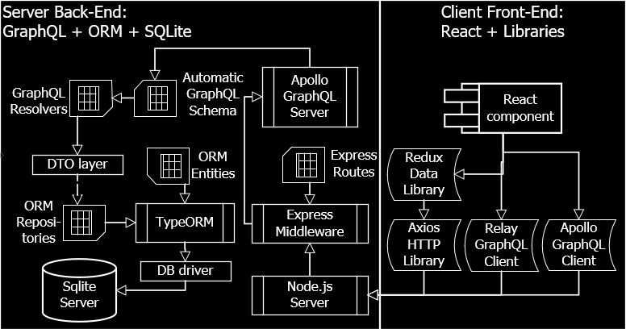
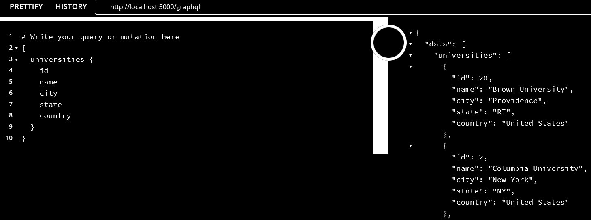
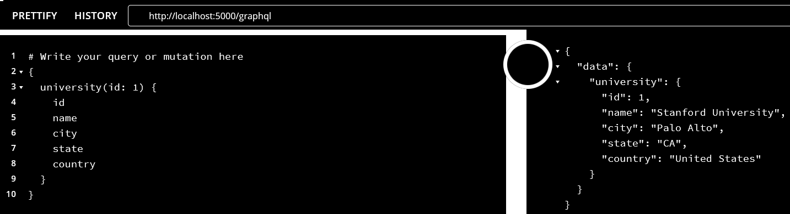
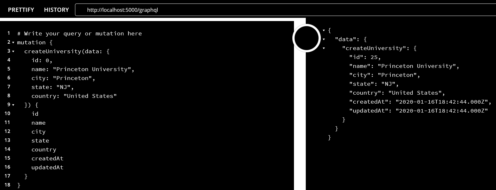
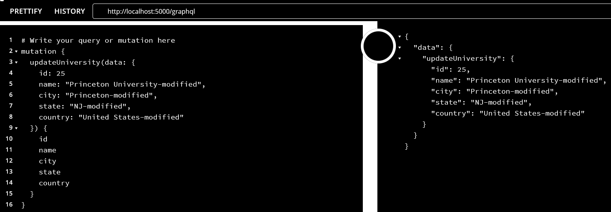
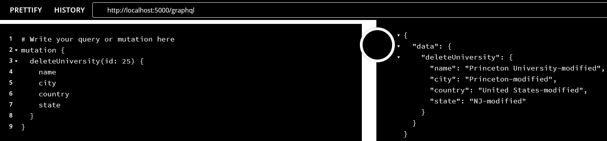

Introduction
============

Description
-----------

### Server

A GraphQL server example built with the following technologies:

-   *apollo-server-express*. Express and Connect integration of GraphQL Server.
    Apollo Server is an open-source GraphQL server that works with many Node.js
    HTTP server frameworks.

-   *graphql*. JavaScript reference implementation for GraphQL, a query language
    for APIs created by Facebook.

-   *typeorm*. An ORM that can run in NodeJS, Browser, Cordova, PhoneGap, Ionic,
    React Native, NativeScript, Expo, and Electron platforms and can be used
    with TypeScript and JavaScript (ES5, ES6, ES7, ES8).

-   *sqlite*. A library that implements a small and self-contained SQL database
    engine.

-   *nest*. A progressive Node.js framework for building server-side
    applications, heavily inspired by Angular.

### Client

A GraphQL client example built with the following technologies:

-   *apollo-client*. A state management library for JavaScript apps. You write a
    GraphQL query, and Apollo Client will take care of requesting and caching
    your data, as well as updating your UI.

-   *graphql*. JavaScript reference implementation for GraphQL, a query language
    for APIs created by Facebook.

-   *react*. JavaScript library for building user interfaces.

-   *react-apollo*. Includes a component for providing an Apollo client instance
    to a React component tree, and a higher-order component for retrieving that
    client instance.

Installation and running
------------------------

-   Github server repository:
    [apollo-typeorm-nest-server](https://github.com/drfausto/apollo-typeorm-nest-server)

-   Github client repository:
    [apollo-react-client](https://github.com/drfausto/apollo-react-client)

### Server

-   \$ cd server-dir

-   \$ npm install

-   \$ npm run start

~~~~~~~~~~~~~~~~~~~~~~~~~~~~~~~~~~~~~~~~~~~~~~~~~~~~~~~~~~~~~~~~~~~~~~~~~~~~~~~~
You can test GraphQL API on localhost:5000/graphql.
~~~~~~~~~~~~~~~~~~~~~~~~~~~~~~~~~~~~~~~~~~~~~~~~~~~~~~~~~~~~~~~~~~~~~~~~~~~~~~~~

### `Client`

-   \$ cd client-dir

-   \$ npm install

-   \$ npm run start

~~~~~~~~~~~~~~~~~~~~~~~~~~~~~~~~~~~~~~~~~~~~~~~~~~~~~~~~~~~~~~~~~~~~~~~~~~~~~~~~
You can test GraphQL client on localhost:3000.
~~~~~~~~~~~~~~~~~~~~~~~~~~~~~~~~~~~~~~~~~~~~~~~~~~~~~~~~~~~~~~~~~~~~~~~~~~~~~~~~

Implementation
==============

Architecture
------------

### Notes

-   On server side DTO (Data Transfer Object) layer is not implemented.

-   It is very easy to change DB server. Thanks to TypeORM.

-   On client side we use Apollo client. It is possible to use other libraries
    too, as the figure shows.

-   Apollo client is library agnostic. There are integrations available for
    Angular and Vue.

Code base
---------

~~~~~~~~~~~~~~~~~~~~~~~~~~~~~~~~~~~~~~~~~~~~~~~~~~~~~~~~~~~~~~~~~~~~~~~~~~~~~~~~
Client UI implementation is based on excellent article from:
~~~~~~~~~~~~~~~~~~~~~~~~~~~~~~~~~~~~~~~~~~~~~~~~~~~~~~~~~~~~~~~~~~~~~~~~~~~~~~~~

-   Node, Express, React.js, Graphql and MongoDB CRUD Web Application.

~~~~~~~~~~~~~~~~~~~~~~~~~~~~~~~~~~~~~~~~~~~~~~~~~~~~~~~~~~~~~~~~~~~~~~~~~~~~~~~~
Server implementation is based on great article from:
~~~~~~~~~~~~~~~~~~~~~~~~~~~~~~~~~~~~~~~~~~~~~~~~~~~~~~~~~~~~~~~~~~~~~~~~~~~~~~~~

-   Nestjs Typeorm Graphql Dataloader tutorial with Typescript.

Graphql Api
-----------

Testing the server on GraphQL Playground.

### Queries

-   Get the list of records

-   Get a record by id

### Mutations

-   Create a record

-   Update a record by id

-   Delete a record by id

Notes
-----

Of course, it is just an example, nothing to put in production in a bank.

### Server

-   Initial project created with nest-cli tool.

-   Nest.js RepoService implemented that gives access to TypeORM repository
    (Data Mapper pattern).

-   TypeORM/GraphQL integration, you don’t need to create GraphQL schema, just
    the resolvers and of course TypeORM entities.

### Client

-   Initial project created with create-react-app tool.

-   UI implementation follows standard react-router pattern.

Todo
----

-   Implementing DTO layer on server.

-   Implementing Data Loader layer on server.

-   Implementing GraphQL subscriptions.

-   Implementing pagination.

-   Fixing automatic render of components. Components are not automatically
    rerendered. I could not fix withrouter problem, sorry.

-   Implementing robust error management.

References
==========

-   Robin Wieruch excellent blog on GraphQL, Apollo and React.

-   For an alternative to GraphQL developed by Netflix and named Falcor, see the
    book:

    -   Mastering Full Stack React Web Development.

-   For an example on Redux and Axios, see the book:

    -   Pro React 16.

-   For examples on React, Redux and GraphQL, see the book:

    -   React Quickly.

-   Codersera blog.

-   DJAMware blog.

~~~~~~~~~~~~~~~~~~~~~~~~~~~~~~~~~~~~~~~~~~~~~~~~~~~~~~~~~~~~~~~~~~~~~~~~~~~~~~~~

~~~~~~~~~~~~~~~~~~~~~~~~~~~~~~~~~~~~~~~~~~~~~~~~~~~~~~~~~~~~~~~~~~~~~~~~~~~~~~~~
